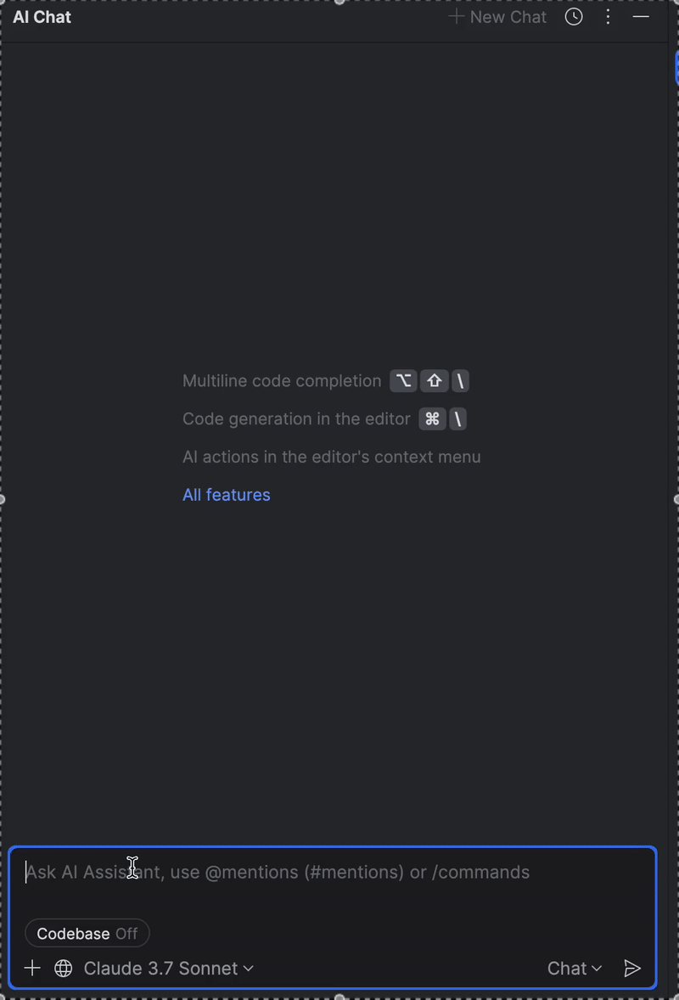

# GitLab Merge Request Review MCP

A Model-Context-Protocol (MCP) tool for interacting with GitLab merge request comments. This tool provides a set of utilities to retrieve information about merge requests from LLM agents.

## Disclaimer
This is just a proof of concept. The tools seems to work well enough for my needs.
The majority of the code in this repository was written by AI Assistant.

## Features

- Retrieve general information about merge requests from the currently checked-out branch
- Fetch comments for merge request by ID

## Installation

### Prerequisites

- Go 1.16 or higher
- A GitLab account with an API token
- A GitLab project where you have appropriate permissions

### Building from Source

1. Clone the repository:
   ```
   git clone https://github.com/ondratuma/gitlab-review-mcp.git
   cd gitlab-review-mcp
   ```

2. Build the project:
   ```
   go build -o gitlab-review-mcp
   ```

## Configuration

The tool requires the following environment variables:

- `GITLAB_TOKEN`: Your GitLab personal access token
- `GITLAB_PROJECT_ID`: The ID of the GitLab project you want to interact with

### Configuration with JetBrains IDEs

1. Go to `settings`->`Tools`->`AI Assisstant`->`Model Context Protocol (MPC)`
2. Add new Server
3. Set the environment variables through the UI
4. Set working directory somewhere in your git repository

### Usage

#### With AI Assistant
In the AI Assistant chat window, **turn the Codebase option on** to access MCP servers.

You can prompt the assistant to fix the review comments for you.
```
Check all the pending Gitlab Review comments and fix them.
```
The AI Assistant is able to pull the list of merge requests, and fetch the comments for the active one.



### Available Tools

#### get_current_branch (local)

Gets the name of the current Git branch.

#### get_merge_request_info

Retrieves general information for merge requests for the currently checked-out branch.

#### get_merge_request_comments

Gets comments for a specific merge request.

Parameters:
- `mergeRequestIID` (required): The internal ID of the merge request

## Debugging
Before creating this tool, I tried several other review tools, but debugging was problematic.

For debugging purposes, a simple proxy script can show you the logs and issue with requests.
You can change the path to the binary in the AI Assistant and see the actual requests being proxied.

```
#!/bin/bash

mkdir -p /tmp/mcp_logs

LOG_FILE="/tmp/mcp_logs/mcp-$(date +%Y%m%d-%H%M%S).log"
INPUT_FILE="/tmp/mcp_logs/mcp-$(date +%Y%m%d-%H%M%S).input"
tee $INPUT_FILE | /path/to/binary 2>&1 | tee -a "$LOG_FILE"
```

## Acknowledgements

This project uses the [mcp-go](https://github.com/mark3labs/mcp-go) library for MCP server functionality.